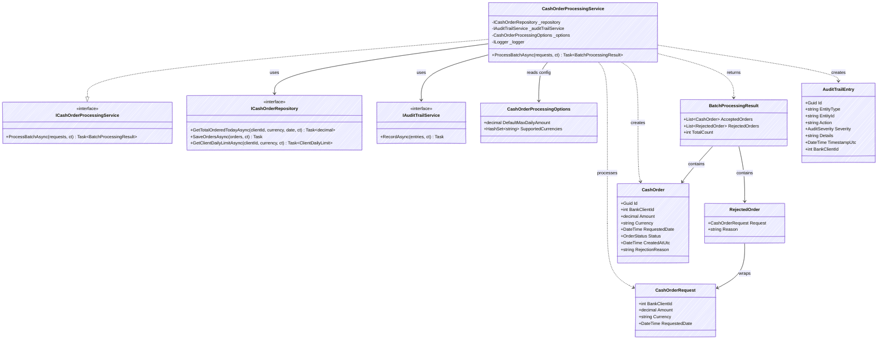
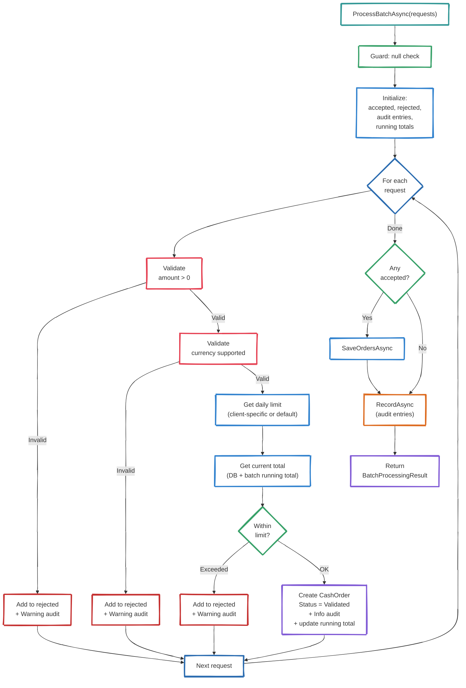

# C4 — Level 4: Code

*Internal structure of the Order Processing Service at the code level*

---

## Class Diagram

---

## Method Flow: ProcessBatchAsync

---

## Audit Entry Construction Rules

| Scenario | EntityType | Action | Severity | Details |
|----------|-----------|--------|----------|---------|
| Order accepted | `CashOrder` | `OrderAccepted` | Info | Amount, currency, client ID |
| Rejected: invalid amount | `CashOrder` | `OrderRejected` | Warning | `Invalid amount: {amount}` |
| Rejected: unsupported currency | `CashOrder` | `OrderRejected` | Warning | `Unsupported currency: {currency}` |
| Rejected: limit exceeded | `CashOrder` | `OrderRejected` | Warning | `Daily limit exceeded: {current}/{limit} {currency}` |
| Empty batch processed | `CashOrder` | `EmptyBatchProcessed` | Info | `No orders in batch` |
