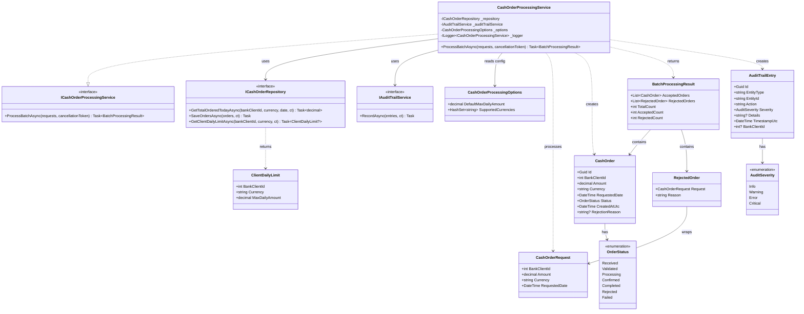

# C4 Model: Code Diagram

## CashOrderProcessingService — Code-Level Design

This diagram shows the internal structure of the Order Processing Service at the code level.



## Method Flow: ProcessBatchAsync

```
ProcessBatchAsync(requests, cancellationToken):
│
├── 1. Guard: throw ArgumentNullException if requests is null
│
├── 2. Initialize:
│   ├── acceptedOrders = new List<CashOrder>()
│   ├── rejectedOrders = new List<RejectedOrder>()
│   ├── auditEntries = new List<AuditTrailEntry>()
│   └── runningTotals = new Dictionary<(int clientId, string currency), decimal>()
│
├── 3. For each request in requests:
│   │
│   ├── 3a. Validate amount > 0
│   │   └── If invalid → add to rejectedOrders, add Warning audit entry
│   │
│   ├── 3b. Validate currency is in SupportedCurrencies (case-insensitive)
│   │   └── If invalid → add to rejectedOrders, add Warning audit entry
│   │
│   ├── 3c. Get daily limit:
│   │   ├── clientLimit = await GetClientDailyLimitAsync(clientId, currency)
│   │   └── effectiveLimit = clientLimit?.MaxDailyAmount ?? options.DefaultMaxDailyAmount
│   │
│   ├── 3d. Get current total (with running total from this batch):
│   │   ├── If not cached: dbTotal = await GetTotalOrderedTodayAsync(clientId, currency, date)
│   │   ├── batchTotal = runningTotals.GetValueOrDefault((clientId, currency), 0)
│   │   └── currentTotal = dbTotal + batchTotal
│   │
│   ├── 3e. Check limit:
│   │   ├── If currentTotal + amount > effectiveLimit → reject, add Warning audit
│   │   └── If within limit:
│   │       ├── Create CashOrder (Id=NewGuid, Status=Validated, CreatedAtUtc=UtcNow)
│   │       ├── Add to acceptedOrders
│   │       ├── Update runningTotals[(clientId, currency)] += amount
│   │       └── Add Info audit entry
│   │
├── 4. If acceptedOrders.Any():
│   └── await repository.SaveOrdersAsync(acceptedOrders, ct)
│
├── 5. await auditTrailService.RecordAsync(auditEntries, ct)
│
└── 6. Return new BatchProcessingResult { AcceptedOrders, RejectedOrders }
```

## Audit Entry Construction Rules

| Scenario | EntityType | Action | Severity | Details |
|----------|-----------|--------|----------|---------|
| Order accepted | "CashOrder" | "OrderAccepted" | Info | Amount, currency, client ID |
| Rejected: invalid amount | "CashOrder" | "OrderRejected" | Warning | "Invalid amount: {amount}" |
| Rejected: unsupported currency | "CashOrder" | "OrderRejected" | Warning | "Unsupported currency: {currency}" |
| Rejected: limit exceeded | "CashOrder" | "OrderRejected" | Warning | "Daily limit exceeded: {current}/{limit} {currency}" |
| Empty batch processed | "CashOrder" | "EmptyBatchProcessed" | Info | "No orders in batch" |
