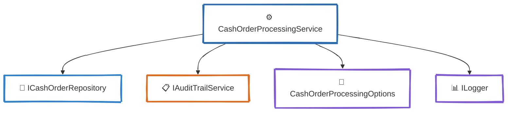
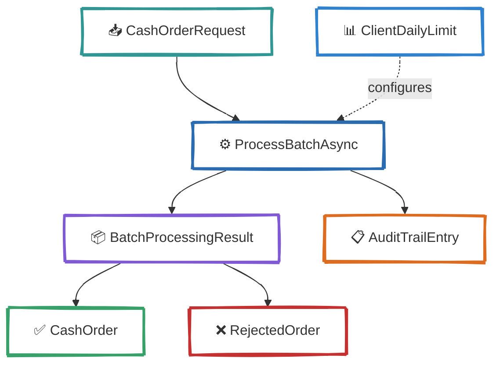
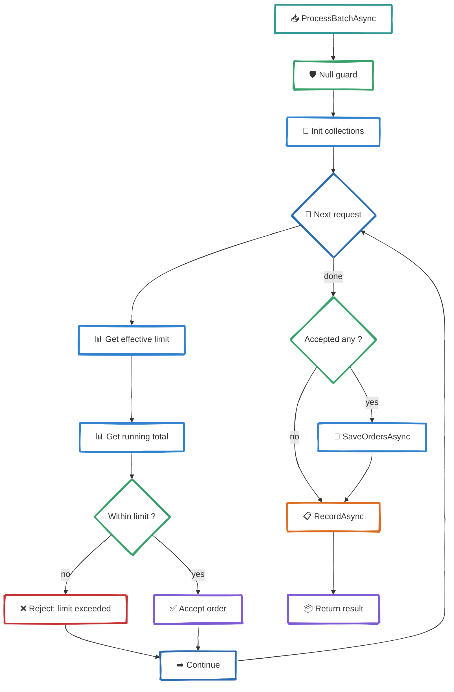

# C4 — Level 4: Code

<div align="center">

*Internal structure of the Order Processing Service at the code level*

</div>

---

## Service Dependencies



### ICashOrderRepository
- `GetTotalOrderedTodayAsync` — sum of all confirmed amounts for a client + currency on a given day
- `GetClientDailyLimitAsync` — per-client limit override, or null for default
- `SaveOrdersAsync` — persist accepted orders

### IAuditTrailService
- `RecordAsync` — persist audit entries for **every** processing decision (regulatory requirement)

### CashOrderProcessingOptions
- `DefaultMaxDailyAmount` — fallback daily limit (500,000)
- `SupportedCurrencies` — allowed currency codes (USD, EUR, UAH, etc.)

---

## Domain Model



### CashOrderRequest (input)
| Property | Type | Description |
|----------|------|-------------|
| BankClientId | int | Identifies the bank client |
| Amount | decimal | Requested cash amount |
| Currency | string | ISO currency code |
| RequestedDate | DateTime | When cash is needed |

### CashOrder (accepted output)
| Property | Type | Description |
|----------|------|-------------|
| Id | Guid | Unique order identifier |
| Status | OrderStatus | Set to `Validated` on acceptance |
| CreatedAtUtc | DateTime | Timestamp of processing |
| RejectionReason | string? | Null for accepted orders |

### RejectedOrder
| Property | Type | Description |
|----------|------|-------------|
| Request | CashOrderRequest | Original request |
| Reason | string | Human-readable rejection reason |

### AuditTrailEntry
| Property | Type | Description |
|----------|------|-------------|
| EntityType | string | Always `"CashOrder"` |
| Severity | AuditSeverity | `Info` for accepted, `Warning` for rejected |
| BankClientId | int? | For multi-tenant isolation |
| Details | string? | Context about the decision |

### ClientDailyLimit
| Property | Type | Description |
|----------|------|-------------|
| BankClientId | int | Client this limit applies to |
| Currency | string | Currency the limit covers |
| MaxDailyAmount | decimal | Maximum daily amount |

---

## Algorithm: ProcessBatchAsync



### Step-by-step

1. **Guard** — throw `ArgumentNullException` if requests is null
2. **Initialize** — empty lists for accepted, rejected, audit entries; dictionary for running totals
3. **For each request:**
   - Get effective limit: `GetClientDailyLimitAsync()` → fallback to `DefaultMaxDailyAmount`
   - Get running total: `GetTotalOrderedTodayAsync()` + batch running total for same (clientId, currency)
   - If `currentTotal + amount > limit` → reject with `Warning` audit
   - Otherwise → create `CashOrder` with `Status = Validated`, `CreatedAtUtc = UtcNow`, update running total, add `Info` audit
4. **Persist** — `SaveOrdersAsync` only if at least one order accepted
5. **Audit** — `RecordAsync` always called (even for empty batches)
6. **Return** — `BatchProcessingResult` with accepted and rejected lists

---

## Audit Entry Rules

| Scenario | Action | Severity |
|----------|--------|----------|
| Order accepted | `OrderAccepted` | Info |
| Limit exceeded | `OrderRejected` | Warning |
| Empty batch | `EmptyBatchProcessed` | Info |

---

## Interface Contracts

```csharp
// Core service — YOUR IMPLEMENTATION
Task<BatchProcessingResult> ProcessBatchAsync(
    IEnumerable<CashOrderRequest> requests,
    CancellationToken cancellationToken = default);
```

```csharp
// Repository — mocked in tests
Task<decimal> GetTotalOrderedTodayAsync(int bankClientId, string currency, DateTime date, CancellationToken ct);
Task SaveOrdersAsync(IEnumerable<CashOrder> orders, CancellationToken ct);
Task<ClientDailyLimit?> GetClientDailyLimitAsync(int bankClientId, string currency, CancellationToken ct);
```

```csharp
// Audit trail — mocked in tests (⭐ star challenge)
Task RecordAsync(IEnumerable<AuditTrailEntry> entries, CancellationToken ct);
```
