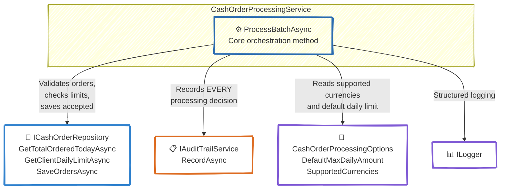
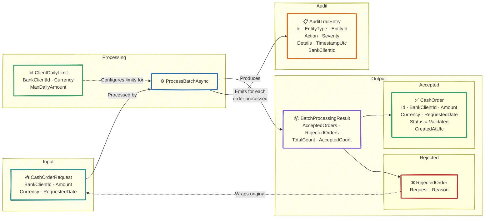
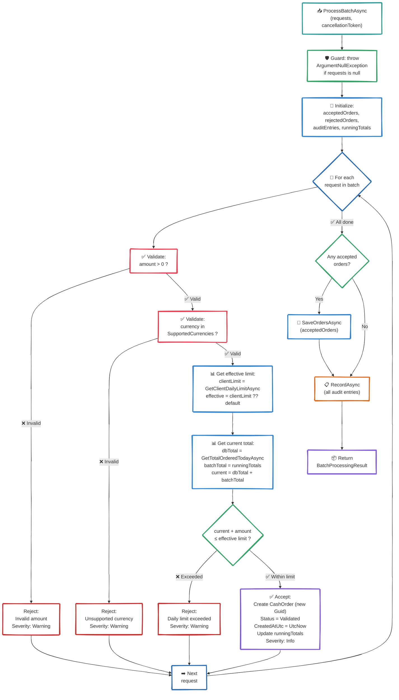

# C4 — Level 4: Code

<div align="center">

*Internal structure of the Order Processing Service at the code level*

</div>

---

## Service Dependencies



---

## Domain Model Relationships



---

## Algorithm: ProcessBatchAsync



---

## Audit Entry Construction Rules

| Scenario | EntityType | Action | Severity | Details |
|----------|-----------|--------|----------|---------|
| Order accepted | `CashOrder` | `OrderAccepted` | Info | Amount, currency, client ID |
| Rejected: invalid amount | `CashOrder` | `OrderRejected` | Warning | `Invalid amount: {amount}` |
| Rejected: unsupported currency | `CashOrder` | `OrderRejected` | Warning | `Unsupported currency: {currency}` |
| Rejected: limit exceeded | `CashOrder` | `OrderRejected` | Warning | `Daily limit exceeded: {current}/{limit} {currency}` |
| Empty batch processed | `CashOrder` | `EmptyBatchProcessed` | Info | `No orders in batch` |

---

## Interface Contracts

### ICashOrderProcessingService
```csharp
Task<BatchProcessingResult> ProcessBatchAsync(
    IEnumerable<CashOrderRequest> requests,
    CancellationToken cancellationToken = default);
```

### ICashOrderRepository
```csharp
Task<decimal> GetTotalOrderedTodayAsync(int bankClientId, string currency, DateTime date, CancellationToken ct);
Task SaveOrdersAsync(IEnumerable<CashOrder> orders, CancellationToken ct);
Task<ClientDailyLimit?> GetClientDailyLimitAsync(int bankClientId, string currency, CancellationToken ct);
```

### IAuditTrailService
```csharp
Task RecordAsync(IEnumerable<AuditTrailEntry> entries, CancellationToken ct);
```
