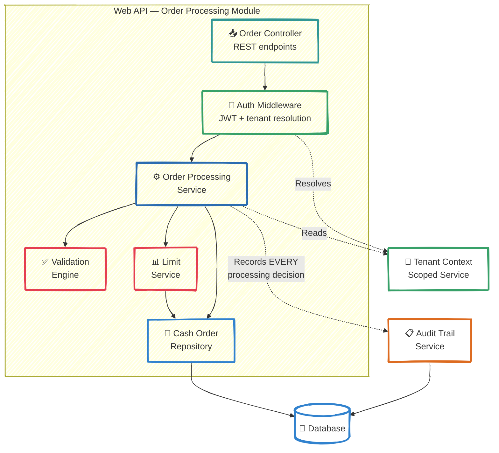
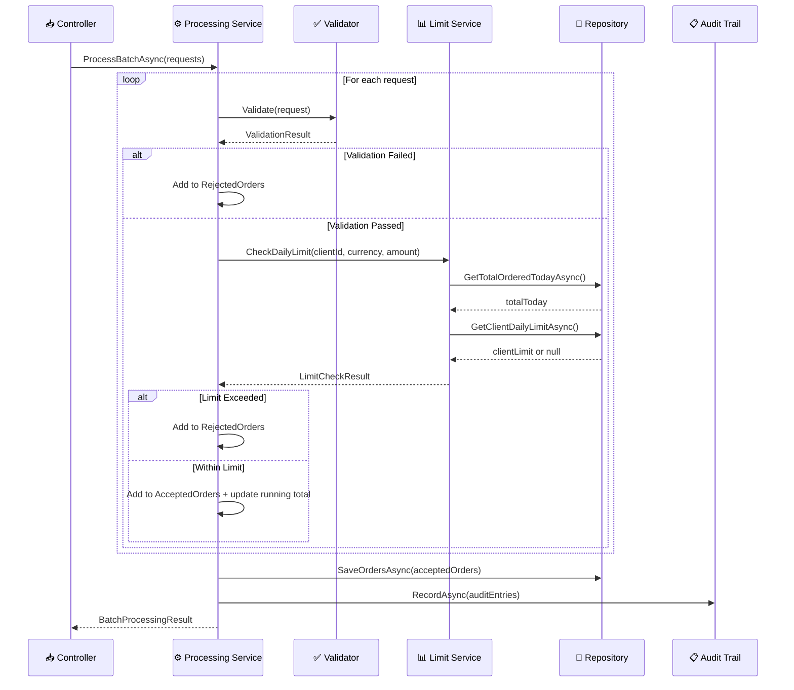
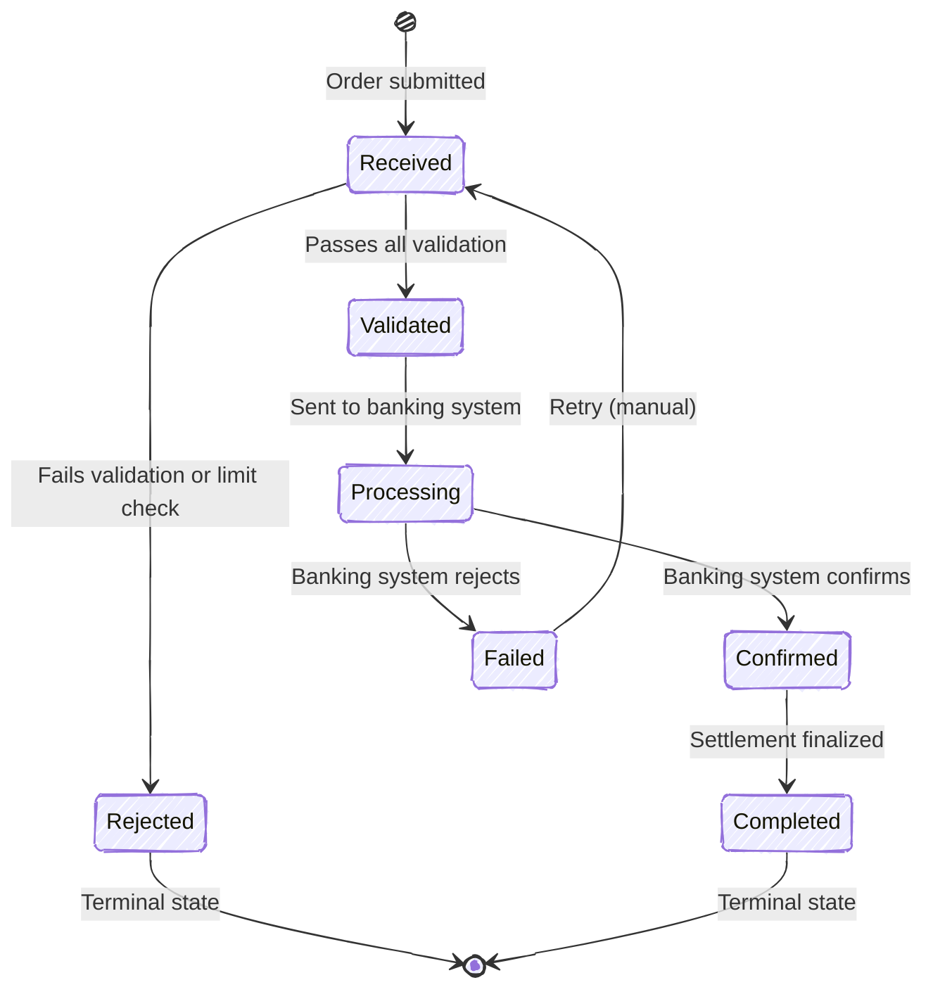

# C4 — Level 3: Components (Order Processing Module)

*How cash order batch processing is orchestrated inside the Web API container*

---

## Component Diagram

---

## Components Explained

### Order Controller
Receives batch requests via `POST /api/orders/batch`, delegates to the processing service, returns results.

### Auth Middleware
Extracts JWT, resolves tenant context (BankClientId), enforces role-based access control.

### Order Processing Service
**Core service (your task)**: orchestrates validation, limit checking, persistence, and audit trail recording.

Interface: `ICashOrderProcessingService`

### Validation Engine
Structural and business rule validation for cash orders:
- amount must be greater than zero;
- currency must be in the supported set;
- case-insensitive currency matching.

### Limit Service
Manages and enforces daily limits per client per currency:
- checks client-specific limits from the database;
- falls back to global default when no custom limit exists;
- tracks running totals within a batch.

### Cash Order Repository
Data access for cash orders, limits, and daily totals.

Interface: `ICashOrderRepository`

### Audit Trail Service
**CRITICAL**: Records every processing decision for regulatory compliance.

Interface: `IAuditTrailService`

Every state transition must be recorded with:
- `EntityType` and `EntityId` for traceability;
- `Severity` level (Info for accepted, Warning for rejected);
- `BankClientId` for multi-tenant audit isolation;
- `TimestampUtc` for chronological reconstruction.

### Tenant Context
Scoped service holding the current `BankClientId` resolved from JWT claims.

---

## ⚠️ Key Architectural Constraint

> **The Order Processing Service MUST call the Audit Trail Service for every batch processing operation.**
>
> This is a **regulatory requirement**. In FinTech systems operating with banking institutions, every decision (accept, reject, validate) must be recorded. Failure to record audit entries constitutes a compliance violation.

---

## Data Flow: Batch Order Processing

---

## State Machine: Cash Order Lifecycle

> **Note**: For this interview task, you implement the `Received → Validated` and `Received → Rejected` transitions. The remaining transitions (Processing, Confirmed, Completed, Failed) are handled by downstream services in the full platform.
