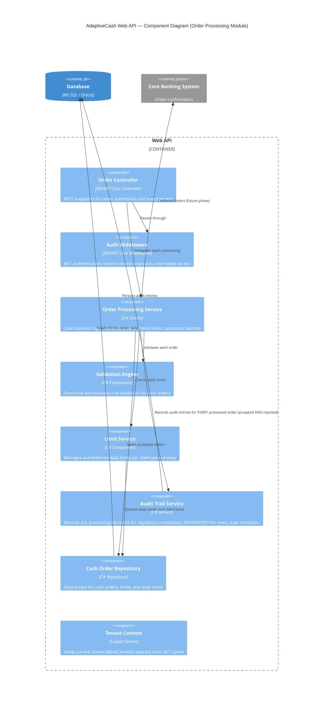
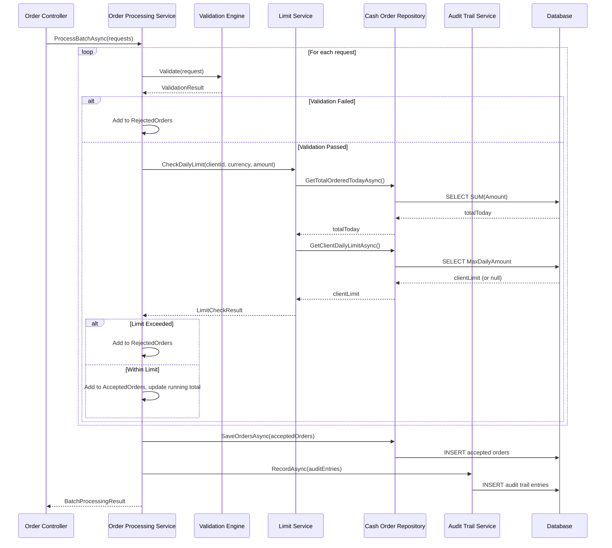
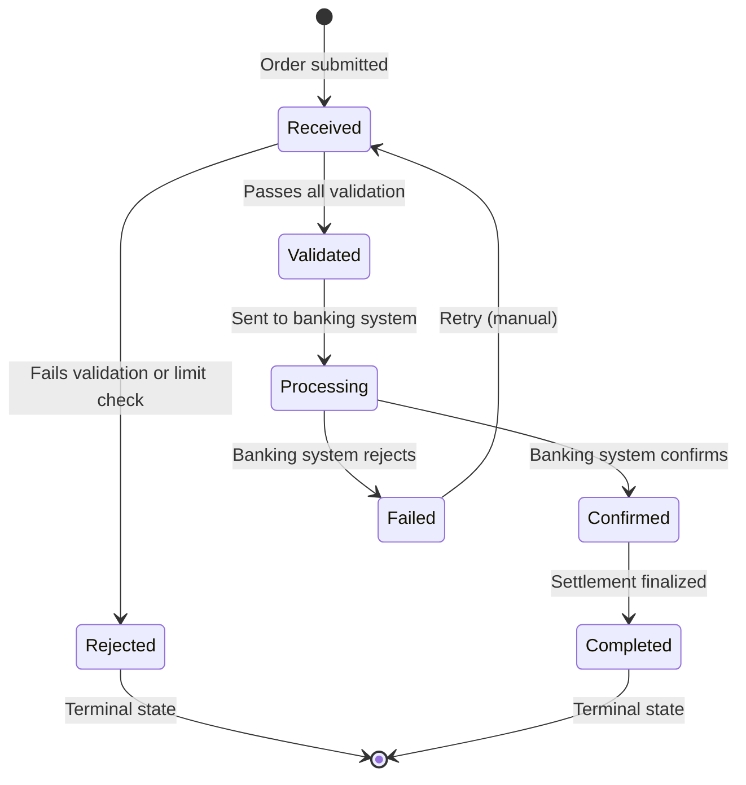

# C4 Model: Component Diagram

## Web API — Component Diagram

This diagram shows the internal components of the Web API container, focusing on the Order Processing module.

## Component Descriptions

| Component | Interface | Responsibility |
|-----------|-----------|----------------|
| **Order Controller** | `POST /api/orders/batch` | Receives batch requests, delegates to processing service, returns results |
| **Auth Middleware** | n/a | Extracts JWT, resolves tenant context, enforces RBAC |
| **Order Processing Service** | `ICashOrderProcessingService` | **Core service (your task)**: orchestrates validation, limit checking, persistence, and audit trail recording |
| **Validation Engine** | Internal | Validates: amount > 0, currency supported, request date valid |
| **Limit Service** | Internal | Checks client-specific and default daily limits with running total tracking |
| **Audit Trail Service** | `IAuditTrailService` | **CRITICAL**: Records every processing decision. Every accepted order → `Info` entry. Every rejected order → `Warning` entry. Every batch → at minimum one audit call. |
| **Cash Order Repository** | `ICashOrderRepository` | CRUD operations for orders, queries for daily totals and client limits |
| **Tenant Context** | Scoped service | Provides `BankClientId` for the current request scope |

## ⚠️ Key Architectural Constraint

> **The Order Processing Service MUST call the Audit Trail Service for every batch processing operation.**
>
> This is a **regulatory requirement**. In FinTech systems operating with banking institutions, every decision (accept, reject, validate) must be recorded with:
> - **Entity type** and **entity ID** for traceability
> - **Severity level** (Info for accepted, Warning for rejected)
> - **Bank client context** for multi-tenant audit isolation
> - **Timestamp** for chronological audit reconstruction
>
> Failure to record audit entries constitutes a compliance violation.

## Data Flow: Batch Order Processing

## State Machine: Cash Order Lifecycle

> **Note**: For this interview task, you implement the `Received → Validated` and `Received → Rejected` transitions. The remaining transitions (Processing, Confirmed, Completed, Failed) are handled by downstream services in the full platform.
