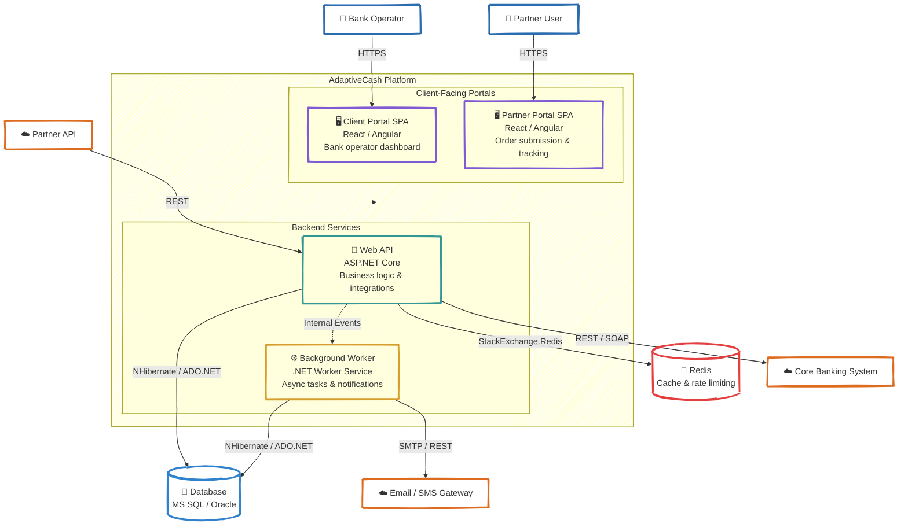

# C4 — Level 2: Containers

<div align="center">

*Major runtime building blocks of the AdaptiveCash platform*

</div>

---

## Container Diagram



---

## Containers Explained

### 1. Client Portal SPA
**Purpose:**
- bank operator dashboard for managing orders, limits, and reports;
- visualizes order processing workflow and system health;
- role-based access for different operator levels.

### 2. Partner Portal SPA
**Purpose:**
- partner-facing portal for order submission and status tracking;
- delivery scheduling and historical reports;
- separate access model from the client portal.

### 3. Web API
**Purpose:**
- central business logic: order processing, validation, limit enforcement;
- authentication and authorization (JWT, RBAC);
- integration endpoints for partner APIs and banking systems;
- audit trail recording for regulatory compliance.

**Why it matters:**
- single deployable with modular internals;
- simplifies deployment for banking customers who prefer on-premise installations;
- all business rules enforced in one place.

### 4. Background Worker
**Purpose:**
- dispatch notifications on order status changes;
- scheduled report generation;
- async processing for long-running operations;
- retry failed external API calls.

### 5. Database (MS SQL / Oracle)
Primary durable store through NHibernate.

Typical structure:
- tenant-isolated order and client tables;
- audit trail tables;
- configuration and limit tables;
- NHibernate chosen specifically for Oracle + MS SQL dual support.

### 6. Redis
Used for:
- session data and frequently accessed configurations;
- rate limiting for partner API endpoints;
- caching hot-path queries (daily totals, client limits).

---

## Container Interactions

### Synchronous path
```text
Portal → Web API → Validate → Check limits → Save → Audit → Response
```

### Asynchronous path
```text
Order saved → Internal event → Worker → Notification → Email/SMS
```

### External integration path
```text
Web API → Core Banking System → Confirmation → Update order status → Audit
```

---

## Why NHibernate

The platform supports both MS SQL and Oracle because different bank clients use different database engines. NHibernate provides mature database-agnostic ORM support with:
- dialect-based SQL generation;
- second-level caching;
- batch fetching strategies;
- XML or Fluent mapping.
