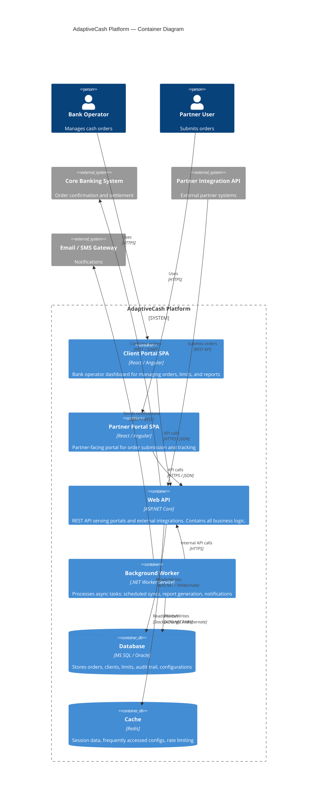

# C4 Model: Container Diagram

## AdaptiveCash Platform — Containers

This diagram shows the major containers (deployable units) that make up the AdaptiveCash platform.

## Container Descriptions

| Container | Technology | Responsibility |
|-----------|-----------|----------------|
| **Client Portal SPA** | React or Angular + TypeScript | Bank operator interface: dashboards, order management, limit configuration, reports |
| **Partner Portal SPA** | React or Angular + TypeScript | Partner interface: order submission, status tracking, delivery scheduling |
| **Web API** | ASP.NET Core 8, REST | Central business logic: order processing, validation, limit enforcement, auth, audit |
| **Background Worker** | .NET Worker Service | Async processing: scheduled tasks, notification dispatching, report generation |
| **Database** | MS SQL Server or Oracle | Persistent storage for all domain data |
| **Cache** | Redis | Performance optimization: session state, hot configurations, rate limiting counters |

## Key Design Decisions

1. **Monolithic API with modular internals** — The Web API is a single deployable unit but internally organized by feature modules. This simplifies deployment for banking customers who prefer on-premise installations.
2. **Dual SPA portals** — Separate portals for bank operators and partners to enforce different access models and UX flows.
3. **Background Worker** — Decoupled from the API to handle long-running or scheduled operations without blocking request processing.
4. **Database agnosticism** — NHibernate is used as ORM specifically to support both MS SQL and Oracle, as different bank clients use different database engines.
