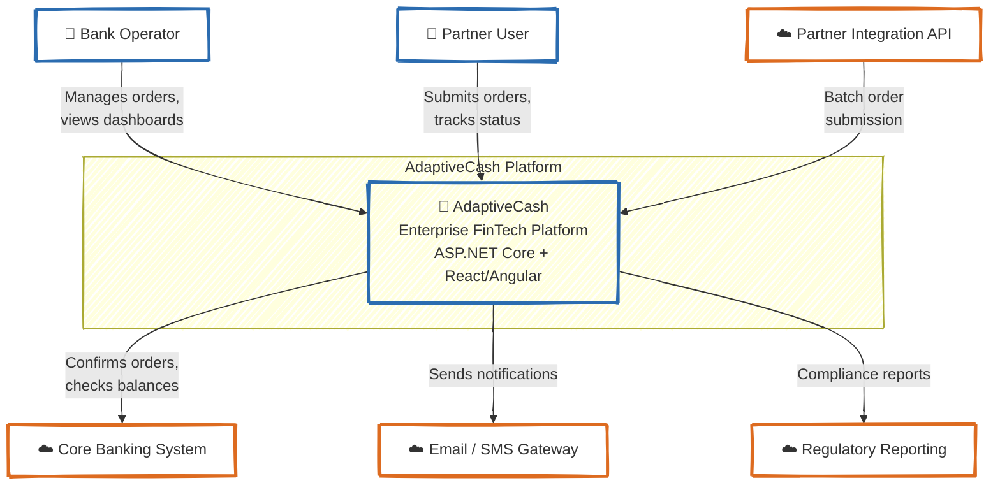

# C4 — Level 1: System Context

*How the AdaptiveCash platform fits into the banking and cash management ecosystem*

---

## Context Diagram

---

## Actors and External Systems

### Bank Operator
Manages cash orders, configures client limits, monitors system health through the Client Portal.

Typical actions:
- review and approve cash orders;
- configure daily limits per client per currency;
- view dashboards and audit trails;
- manage partner access.

### Partner User
Cash-in-transit company operator who submits orders and tracks delivery status through the Partner Portal.

Typical actions:
- submit batch cash orders;
- track order status and delivery;
- view historical reports.

### Partner Integration API
External partner systems that submit orders programmatically via REST API.

### Core Banking System
Bank's core system for account management and settlement. The platform confirms orders and settles transactions through this integration.

### Email / SMS Gateway
Notification delivery infrastructure for order confirmations, status updates, and escalation alerts.

### Regulatory Reporting System
Financial regulator's data submission endpoint. The platform generates and submits compliance reports covering all processed transactions and audit trail data.

---

## System Responsibilities

The AdaptiveCash platform is responsible for:
- receiving and validating cash order requests from portals and APIs;
- enforcing daily limits and business rules per bank client;
- confirming orders with the core banking system;
- recording a full audit trail of every processing decision;
- providing dashboards and reports for bank operators;
- sending notifications on order status changes;
- generating regulatory compliance reports.

It is **not** responsible for:
- replacing the core banking system;
- physical cash logistics and delivery;
- direct management of bank accounts.

---

## Key Risks Visible at Context Level

- Data isolation failure between bank clients in multi-tenant setup
- External banking system unavailability blocking order confirmation
- Regulatory non-compliance if audit trail is incomplete
- Partner API abuse if rate limiting and validation are insufficient
