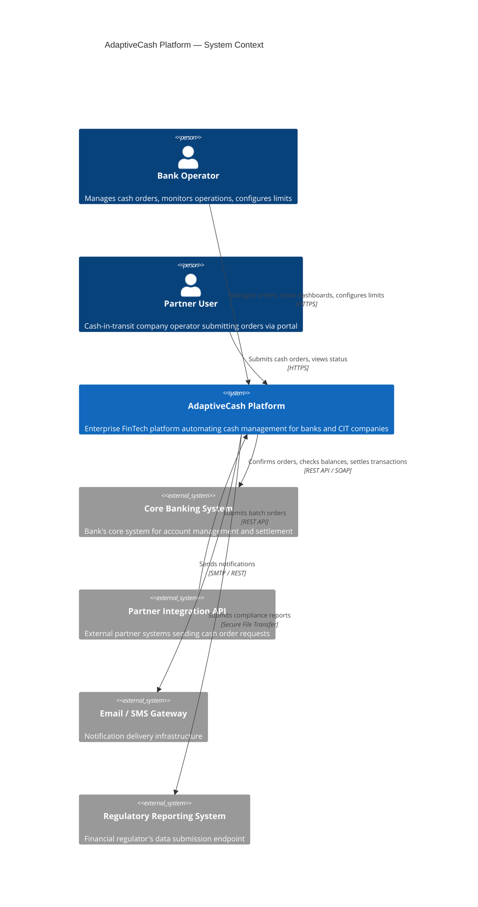

# C4 Model: Context Diagram

## System Context — AdaptiveCash Platform

This diagram shows the AdaptiveCash platform in the context of its users and external systems.

## Key Relationships

| From | To | Interaction | Protocol |
|------|----|-------------|----------|
| Bank Operator | AdaptiveCash | Order management, dashboards | HTTPS (SPA) |
| Partner User | AdaptiveCash | Order submission, status tracking | HTTPS (SPA) |
| Partner Integration API | AdaptiveCash | Batch order submission | REST API |
| AdaptiveCash | Core Banking System | Order confirmation, settlement | REST / SOAP |
| AdaptiveCash | Email/SMS Gateway | Notifications | SMTP / REST |
| AdaptiveCash | Regulatory Reporting | Compliance reports | SFTP |

## Notes

- The platform serves **multiple bank clients** (multi-tenant architecture).
- Each bank client may have multiple partner companies using the platform.
- All interactions with external systems must be **auditable** for regulatory compliance.
- The Core Banking System integration is critical-path: if it's unavailable, orders cannot be confirmed.
